# JOIN-HERO
_Not the hero we wanted, but the one that we deserved._

Transform DDL that describes keys (foreign, primary and unique) into partnerApps join metadata that can be ingested by various and sundry partnerApps to link relational tables and views.

- [JOIN-HERO](#join-hero)
  - [Exporting DDL from the Datamodel](#exporting-ddl-from-the-datamodel)
  - [Generating Metadata Update SQL Commands](#generating-metadata-update-sql-commands)
    - [Usage](#usage)
  - [Running SQL Commands](#running-sql-commands)

## Exporting DDL from the Datamodel
 The join-hero utility derives join metadata using a DDL export generated from the Oracle SQL Data Model Utility. This metadata is converted to a standard format used by other tools to overlay the join layer. 
 
 Use the following step to convert the Datamodel into a .ddl file containing valid Oracle SQL for defining Oracle objects.


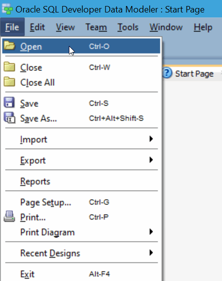
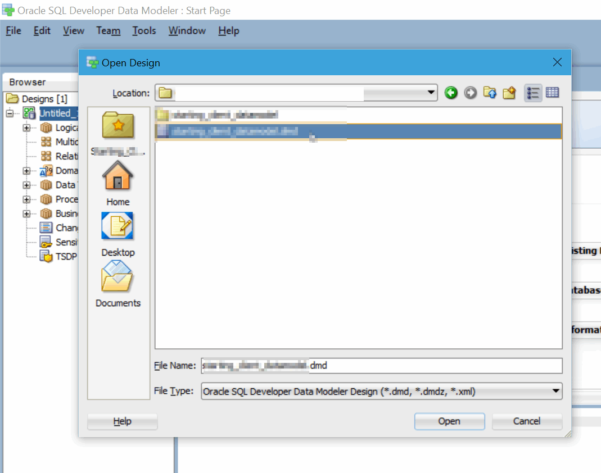
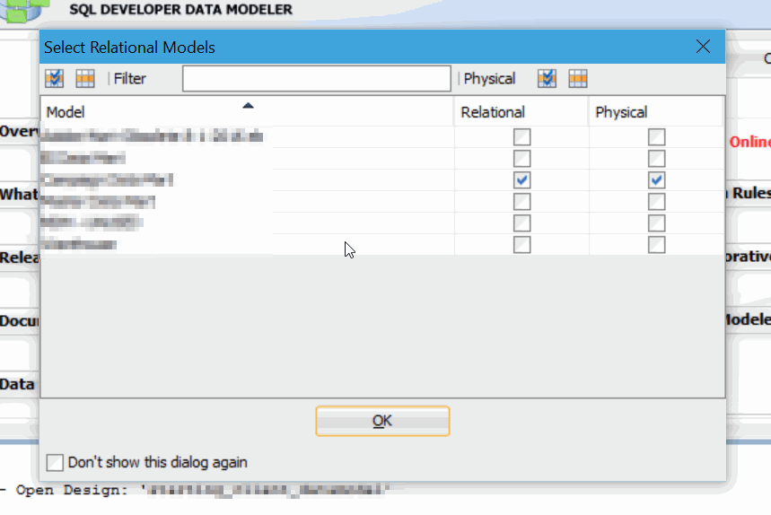
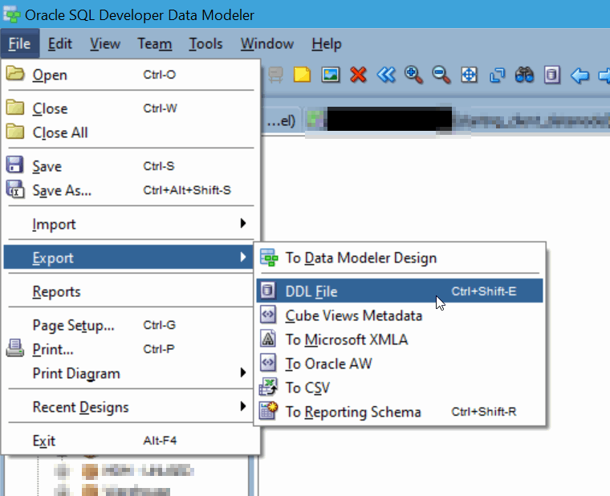
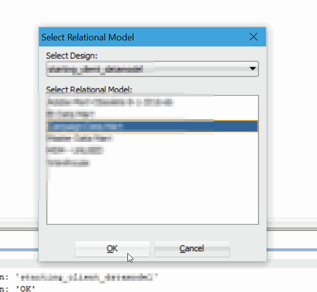
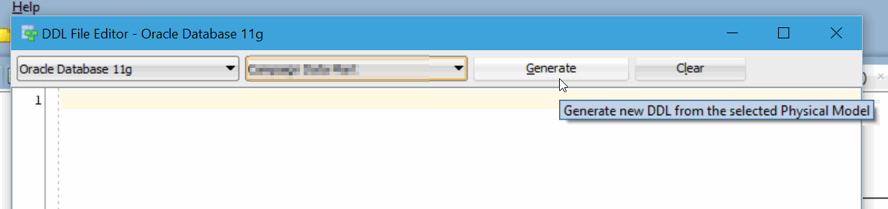
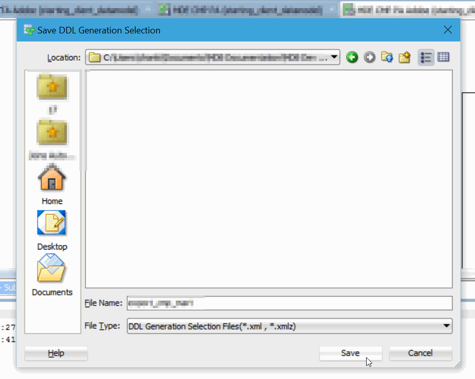
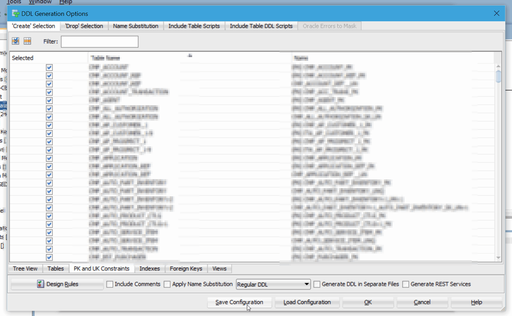

The following object types are required (each has their own tab, make sure they are checked in the export).
  -  PK and UK Constraints
  -  Indexes
  -  Foreign Keys


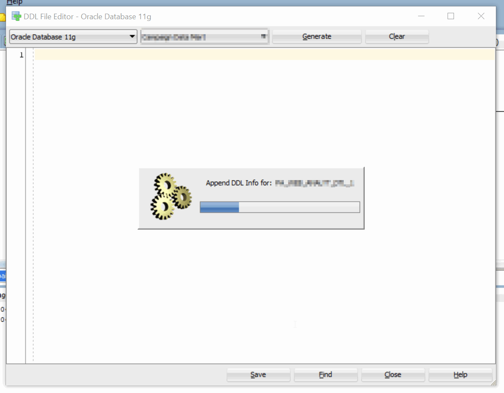
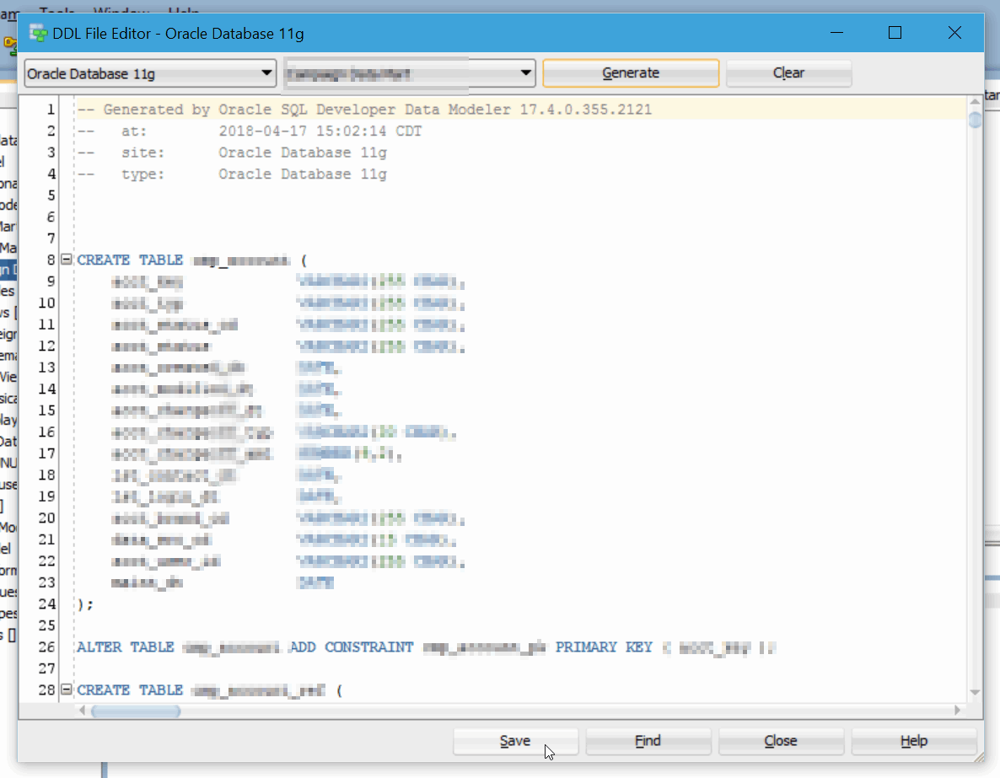

Sanity check the generated SQL code, insure that it has all the required DDL statements mentioned above.

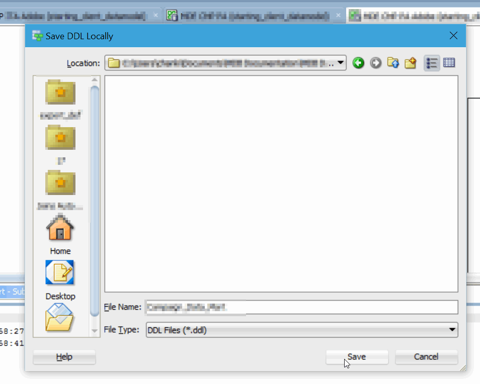
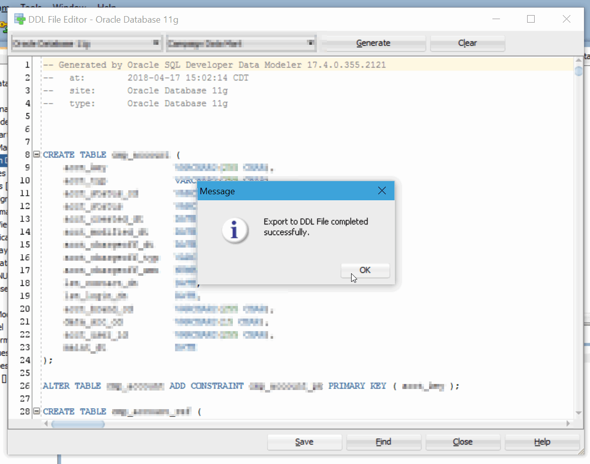

Save the generated DDL file somewhere that the join-hero utility can read it.


## Generating Metadata Update SQL Commands

### Usage
**This section may not be fully up to date, please check the source code for the most up to date usage**


```bash
# Generate a full_insert.sql file containing SQL commands to update metadata
perl join_hero.pl -i './17.4 Export/17.4 CMP Adobe Export - FKs and PKs.ddl' -o './update_sql/full_insert.sql' -v > ./logs/full_insert.log

# Override target tables to research tables, include delete flag for cleanup
perl join_hero.pl -i '.\ddl\Campaign_Data_Mart.ddl' -o './update_sql/full_update.sql' > ./logs/full_update.log --martTableJoinTableName 'TEMP_MERGED_MTJ' --martTableJoinCardinalityTableName 'TEMP_MERGED_MTJ_CARD' -d
```

## Running SQL Commands
The output of join-hero can be executed via your favorite SQL execution engine that can handle statements delimited by semicolons.